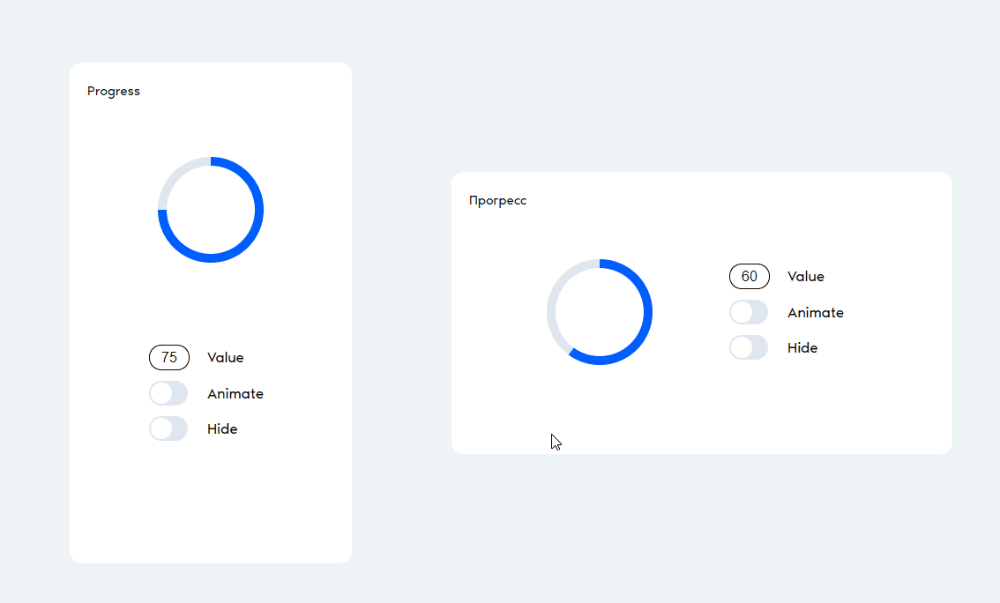
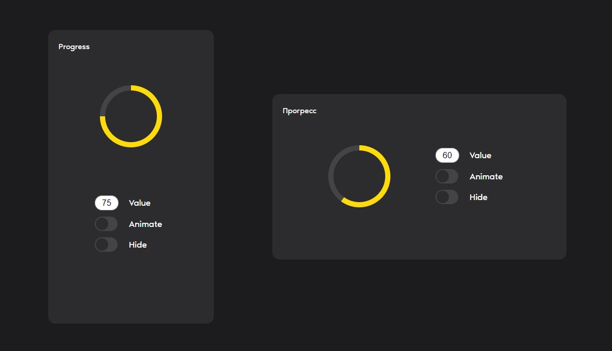

# Progress

## Обзор

Проект включает в себя реализацию двух веб-компонентов, предназначенных для отображения и управления прогрессом выполнения процессов в web-приложениях.



## Компоненты

### `progress-loader`

Основной компонент, который отображает прогресс выполнения в виде заполняемой дуги в круге. 

### `progress-settings`

Компонент для управления настройками `progress-loader`. Он позволяет изменять состояние `progress-loader` через пользовательский интерфейс. Компонент связывается с `progress-loader` через атрибут `for`, который принимает идентификатор целевого компонента `progress-loader`.

## API

### Атрибуты `progress-loader`

- `value` - Принимает число от `0` до `100`, определяя процент заполнения круга дугой.
- `transparent` - Без значения. При наличии делает компонент полностью прозрачным.
- `animated` - Без значения. При наличии активирует анимацию вращения.

### Атрибуты `progress-settings`

- `for` - Принимает строку с идентификатором компонента `progress-loader`, который будет управляться данным компонентом `progress-settings`.
- Атрибуты `value`, `transparent` и `animated` используются для указания значений по-умолчанию.

## Пример кода
```html
<section class="progress">
  <h1 class="progress__title">Progress</h1>
    <progress-loader id="target" class="progress__loader" />
    <progress-settings
      for="target"
      value="75"
      class="progress__settings"
    />
</section>
```

## Технологии
- Web Components
- Vite (для сборки и разработки проекта)

## Адаптивность

- Container/Media Queries для адаптации под различные размеры экрана и ориентацию устройства.
- Поддержка темной темы, которая автоматически переключается в соответствии с предпочтениями системы пользователя.


